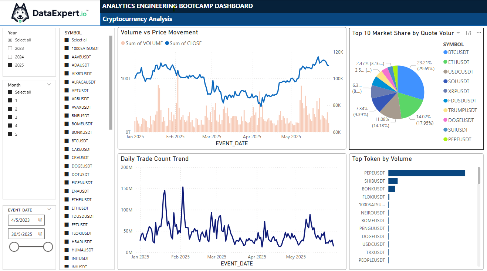

# 🧊 Cryptocurrency Analytics Pipeline with Iceberg, Snowflake & Power BI

## 📌 Project Overview

This capstone project aims to build an automated data pipeline that ingests, processes, and visualizes cryptocurrency market data for top USDT trading pairs. The solution is architected with open-source and cloud-native tools — ensuring scalability, auditability, and analytical readiness.

---

## 🚀 Goals

- ✅ Ingest historical OHLCV (Open-High-Low-Close-Volume) data for top 50 USDT trading pairs from Binance API.
- ✅ Store data in an Apache Iceberg table with daily partitioning for scalable querying and snapshot versioning.
- ✅ Sync raw Iceberg data to Snowflake as a staging layer for downstream transformation.
- ✅ Build dbt models to generate clean, queryable analytics marts.
- ✅ Visualize trade trends, price movements, and market dominance in Power BI.

---

## 📂 Data Sources

| Source         | Description                              |
|----------------|------------------------------------------|
| Binance API    | Historical OHLCV data for crypto symbols |
| Iceberg Table  | Stores raw `crypto_daily_ohlcv` data     |
| Snowflake DB   | Used for analytics modeling with dbt     |
| Power BI       | Final dashboard with business KPIs       |

---

## 🧱 Architecture & Tools

| Layer           | Tool / Platform                |
|------------------|-------------------------------|
| Ingestion        | Python + Binance REST API      |
| Storage Format   | Apache Iceberg (Tabular)       |
| Metadata Catalog | Tabular Cloud Catalog          |
| Pipeline Orchestration | Apache Airflow (Astro Runtime) |
| Transformations  | dbt with Snowflake warehouse   |
| Visualization    | Power BI (direct Snowflake connector) |

---

## 🔁 Pipeline Flow

```
    Binance API
        ↓
  crypto_iceberg_etl.py (Python)
        ↓
  Iceberg Table: `chunghaw.crypto_daily_ohlcv`
        ↓
  load_to_snowflake.py → Snowflake Table: `DATAEXPERT_STUDENT.CHUNGHAW.CRYPTO_DAILY_OHLCV`
        ↓
  dbt (staging + mart models)
        ↓
  Power BI Dashboard
```

---

## 📊 Power BI Dashboard Highlights



### Visuals:

| Visualization                       | Description                                                                 |
|-------------------------------------|-----------------------------------------------------------------------------|
| 📈 Volume vs Price Movement         | Tracks trade volume vs close price trends over time                         |
| 🧠 Daily Trade Count Trend          | Monitors daily number of trades across symbols                              |
| 🍩 Market Share by Quote Volume     | Pie chart showing top 10 crypto by total USDT-traded value (quote volume)  |
| 📦 Top Tokens by Volume             | Highlights highest traded tokens by unit volume                             |
| 📅 Filters                          | Year, Month, Symbol, and Date Range slicers for flexible analysis           |

---

## 🗃️ DBT Models

- `stg_crypto_daily_ohlcv`: Cleans and stages raw data from Snowflake
- `fact_crypto_daily`: Incremental mart with primary key `symbol + event_date`

---

## ⚙️ Run Locally

1. Clone the project and set up `.env` with Snowflake, Tabular, and Binance config
2. Start Astro:  
   ```bash
   astro dev start
   ```
3. Trigger pipeline manually or schedule via Airflow UI
4. Run `dbt run` and `dbt test` from DAG or terminal
5. Connect Power BI → Snowflake → select `DATAEXPERT_STUDENT.CHUNGHAW`

---

## ✅ Future Enhancements

- Add hourly resolution data
- Track real-time prices with WebSocket streaming
- Extend to Stocks, NFT or DeFi token analytics
- Implement TradingView Signals by using TradingView API
- Implement LLM Insights by using ChatGPT API

---

## 👤 Author

- **Name**: Chung Haw Tan  
- **Bootcamp**: DataExpert.io - Analytics Engineering Bootcamp  
- **Date**: May 2025

